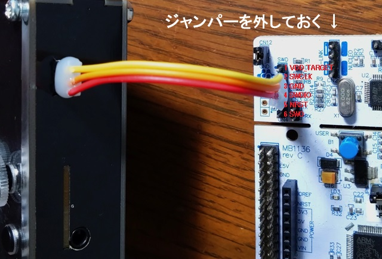

# プログラム書き込み、デバッグ

例として、サンプルプログラムの書き込み、デバッグまでの手順を説明します。

***

### 1. STM32CubeIDEのインストール
STM32マイコンの統合開発環境として、[STM32CubeIDE](https://www.st.com/ja/development-tools/stm32cubeide.html)をインストールします（32bitのOSには非対応）。ダウンロードに[myST](https://www.st.com/content/st_com/ja.html)への登録が必要です。初回起動時にWorkspace（作業フォルダ）を設定しますが、パスに全角文字が入らないようにしておきます。STM32CubeIDE未経験の方は、練習としてNucleo Boardを使ったLチカを先にされておくことをお勧めします。

- 参考ページ → [STM32 Nucleo STM32F303K8でLチカ & STM32CubeIDEで開発](https://ameblo.jp/denshi-1996/entry-12806626635.html)

***

### 2. 新規プロジェクト作成
- STM32CubeIDEを起動、File → New → STM32 Project
- Commercial Part Number に「h723vg」と入力 → STM32H723VGT6 を選択 → Next
- Project Name に「Chlorine_example」と入力、Options の Targeted Language に C++ を選択 → Finish
- Memory Protection Unit についてのダイアログ → Yes
- 自動で開かれる Chlorine_example.ioc は閉じる

※ 初回はデータのダウンロード等があるため時間がかかります。

***

### 3. 必要なファイルのダウンロード、コード出力、ビルド

下記URLからzipファイルをダウンロード・展開し、出てきたファイルを移動させます。
- [https://github.com/kanengomibako/Chlorine/blob/main/Src/example/Chlorine_example_v0.1.zip](https://github.com/kanengomibako/Chlorine/blob/main/Src/example/Chlorine_example_v0.1.zip)
	
	- Chlorine_example.ioc と STM32H723VGTX_FLASH.ld → プロジェクトフォルダ内の同名ファイルに上書き
		- Chlorine_example.ioc を開き、歯車アイコンをクリックしてコード出力
		
		  ※ バージョンが違うといったメッセージが表示された場合は、「Continue」を選択します。
		
	- .cファイル　.cppファイル → Core/Src フォルダへ（ main.c は上書き）
	
	- .hファイル　.hppファイル → Core/Inc フォルダへ
	
- 金槌アイコンをクリックしてビルド開始

- common.h を編集すると時間設定等を行うことができます。

- fx.cpp を編集すると有効化するエフェクトを選択できます。

***

### 4. デバッガの接続、デバッグ
- デバッガのSWCLK、GND、SWDIOピンを、Chlorine側のピンソケットへそれぞれ接続

  ▼ Nucleo Board（Nucleo-64タイプ）を使う場合（左上のジャンパーを外しておく）

  

- 虫アイコンをクリック → Edit Configuration ウィンドウ → そのままOK

プログラムが書き込まれ、デバッグが開始されます。デバッグ画面では動作開始、一時停止等の操作を行うことができます。

サンプルプログラムの操作方法については、[初期プログラムについて](000_初期プログラムについて.md)のページをご参照ください。