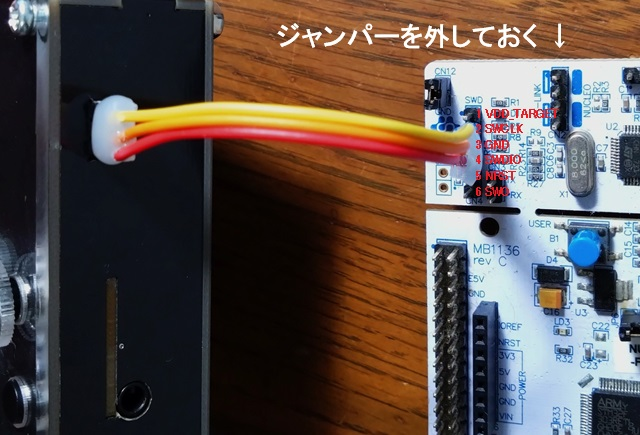

# プログラム書き込み、デバッグ

例として、サンプルプログラムの書き込み、デバッグまでの手順を説明します。

***

### 1. STM32CubeIDE、STM32CubeMXのインストール
STM32マイコンの統合開発環境として、[STM32CubeIDE](https://www.st.com/ja/development-tools/stm32cubeide.html)と[STM32CubeMX](https://www.st.com/ja/development-tools/stm32cubemx.html)をインストールします（32bitのOSには非対応）。ダウンロードに[myST](https://www.st.com/content/st_com/ja.html)への登録が必要です。初回起動時にWorkspace（作業フォルダ）を設定しますが、パスに全角文字が入らないようにしておきます。STM32CubeIDE未経験の方は、練習としてNucleo Boardを使ったLチカを先にされておくことをお勧めします。

- 参考ページ → [STM32CubeIDE 2.0.0 workflow tutorial](https://community.st.com/t5/stm32-mcus/stm32cubeide-2-0-0-workflow-tutorial/ta-p/864831)

***

### 2. 必要なファイルのダウンロード、コード出力、ビルド

- 下記URLからzipファイルをダウンロード・展開

  [https://github.com/kanengomibako/Chlorine/blob/main/Src/example/Chlorine_example_v0.2.zip](https://github.com/kanengomibako/Chlorine/blob/main/Src/example/Chlorine_example_v0.2.zip)

- Workspace（作業フォルダ）内に、新しく「Chlorine_example」というフォルダを作成

- Chlorine_example.iocをChlorine_exampleフォルダ内に移動

- STM32CubeMXを起動 → Other Projects から Chlorine_example.iocを読み込み → GENERATE CODE

  ※ バージョンが違うといったメッセージが表示された場合は、「Continue」を選択します。

  ※ 初回はファームウェアのダウンロード等があるため時間がかかります。

- ダウンロード・展開したファイルを移動
	- STM32H723VGTX_FLASH.ld → プロジェクトフォルダ内の同名ファイルに上書き
		
	- .cファイル　.cppファイル → Core/Src フォルダへ（main.c は上書き）
	
	- .hファイル　.hppファイル → Core/Inc フォルダへ
	
- STM32CubeIDEを起動 → File → STM32 Project Create/Import → STM32CubeMX/STM32CubeIDE Projectを選択 → Chlorine_exampleフォルダを選択

- プロジェクトを右クリックし、Convert to C++ → 金槌アイコンをクリックしてビルド

- common.h を編集すると時間設定等を行うことができます。

- fx.cpp を編集すると有効化するエフェクトを選択できます。

***

### 3. デバッガの接続、デバッグ
- デバッガのSWCLK、GND、SWDIOピンを、Chlorine側のピンソケットへそれぞれ接続

  ▼ Nucleo Board（Nucleo-64タイプ）を使う場合（左上のジャンパーを外しておく）

  

- 虫アイコンをクリック → Edit Configuration ウィンドウ → そのままOK

プログラムが書き込まれ、デバッグが開始されます。デバッグ画面では動作開始、一時停止等の操作を行うことができます。

サンプルプログラムの操作方法については、[初期プログラムについて](000_初期プログラムについて.md)のページをご参照ください。