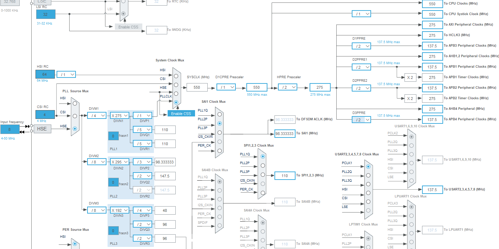
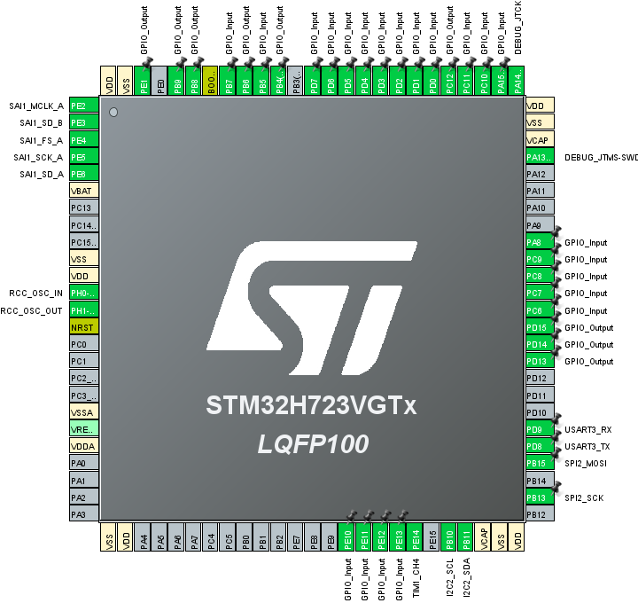

# マイコンの機能設定

iocファイルを開くと、STM32マイコンのピンや機能の設定を行うことができます。Chlorineでの設定内容について説明します。

**2025年4月7日時点の最新STM32CubeMXソフトウェア（6.14）では、SAIの設定を行うことができません。iocファイルをテキストエディタで開き、「MxCube.Version=6.13.0」「MxDb.Version=DB.6.0.130」と編集すると旧バージョンになります。開くときに新しいバージョンに移行する（Migrate）かダイアログが出るので、旧バージョンのままの Continue を選択します。**

***

### 1. System Core
＜キャッシュを有効化、MPUの設定＞
- System Core → CORTEX_M7
	- CPU ICache : Enabled
	- CPU DCache : Enabled
	- MPU Control Mode : Background Region Privileged accesses only + MPU Disabled during ～
	- MPU Region : Enabled
	- MPU Region Base Address : 0x30000000
	- MPU Region Size : 512B
	- MPU SubRegion Disable : 0x0
	- MPU TEX field level : level 0
	- MPU Access Permission : ALL ACCESS PERMITTED
	- MPU Instruction Access : ENABLE
	- MPU Shareability Permission : ENABLE
	- MPU Cacheable Permission : DISABLE
	- MPU Bufferable Permission : ENABLE

＜クロック源として外部水晶振動子を使用、レギュレータの設定＞
- System Core → RCC
	- High Speed Clock (HSE) : Crystal/Ceramic Resonator
	- Parameter Settings タブ
	  - Power Regulator Voltage Scale : Power Regulator Voltage Scale 0

***
### 2. Timers
＜ディスプレイの輝度調整のため、PWMを有効化＞
- Timers → TIM1
  - Channel4 : PWM Generation CH4
  - Parameter Settings タブ Counter Settings
    - Prescaler (PSC - 16 bits value) : 0
    - Counter Period (AutoReload Resister - 16 bits value) : 1023

***

### 3. Connectivity

＜EEPROM接続のため、I2C2を有効化＞

- Connectivity → I2C2
  - I2C : I2C
  - Parameter Settings タブ
    - I2C Speed Mode : Fast Mode
    - I2C Speed Frequency (KHz) : 400
- PB10、PB11 を使うようにピン設定

＜ディスプレイ接続のため、SPI2を有効化＞

- Connectivity → SPI2
  - Mode : Half-Duplex Master
  - Parameter Settings タブ
    - Data Size : 8 Bits
    - Prescaler (for Baud Rate) : 32
- PB13、PB15 を使うようにピン設定

＜MIDI信号送受信のため、USART3を有効化＞

- Connectivity → USART3
  - Mode : Asynchronous
  - Parameter Settings タブ
    - Baud Rate : 31250 Bits/s
    - Stop Bits : 1
    - MSB First : Disable
  - NVIC Settings タブ
    - USART3 global interrupt にチェック
- PD8 、PD9 を使うようにピン設定
- System Core → NVIC（割り込みの優先度を設定）
  - USART3 global interrupt の Preemption Priority : 5

***

### 3. Multimedia 
＜オーディオコーデック接続のため、SAI1を有効化＞
- Multimedia → SAI1
  - SAI A
    - Mode : Master with Master Clock Out
    - I2S/PCM Protocolにチェック
  - SAI B
    - Mode : Synchronous Slave
    - I2S/PCM Protocolにチェック
- Parameter Settings タブ
  - SAI A
    - Audio Mode : Master Receive
    - Data Size : 32 Bits
    - Audio Frequency : 48 KHz
    - Fifo Threshold : Half Full
  - SAI B
    - Audio Mode : Slave Transmit
    - Data Size : 32 Bits
    - Fifo Threshold : Half Full
- DMA Settings タブ
  - Addボタンで追加 → DMA Request [SAI1_A]  Priority [Very High]
    - Mode : Circular
    - Data Width (Peripheral) : Word
    - Data Width (Memory) : Word
  - Addボタンで追加 → DMA Request [SAI1_B]  Priority [Very High]
    - Mode : Circular
    - Data Width (Peripheral) : Word
    - Data Width (Memory) : Word
- PE2、PE3、PE4、PE5、PE6 を使うようにピン設定

***

### 4. Trace and Debug

＜デバッガーの接続方式を設定＞

- Trace and Debug → DEBUG
  - Debug : Serial Wire

***

### 5. Clock Configuration
Clock Configuration タブで下図の通り設定

 

実際のオーディオサンプリングレートは、SAIクロックを2の累乗数で割った数となるため、98.333 MHz ÷ 2048 ＝ 48014.32 Hz です。48kHzから少しズレますが、プログラム上の定義をこの値にすれば実用上問題はありません（#define SAMPLING_FREQ 48014.32f）。

オーディオサンプリングレートを44.1kHzにする場合は、DIVN2とDIVP2を [×271] [/3] とすると誤差が少ないです（90.333 MHz ÷ 2048 ＝ 44108.07 Hz）。

***

### 6. スイッチ・LED（GPIO）
- Pinout viewでGPIO_Input、GPIO_Outputを設定

 

- System Core → GPIO からUser Labelを設定

User Labelの定義は、main.h に自動出力されます。（例：#define LED_B_Pin GPIO_PIN_12）

| ピン | ユーザーラベル |
| ---- | ---- |
| PA8 | RE2A |
| PA15 | RE2B |
| PB4 | LED_G |
| PB5 | RE0A |
| PB6 | LED_R |
| PB7 | RE0B |
| PB8 | M0 |
| PB9 | M1 |
| PC6 | SW9 |
| PC7 | RE3B |
| PC8 | SW3 |
| PC9 | RE3A |
| PC10 | SW5 |
| PC11 | SW4 |
| PC12 | LED_B |
| PD0 | SW2 |
| PD1 | SW8 |
| PD2 | SW1 |
| PD3 | RE1A |
| PD4 | SW7 |
| PD5 | RE1B |
| PD6 | SW6 |
| PD7 | SW0 |
| PD13 | LCD_RS |
| PD14 | LCD_RES |
| PD15 | LCD_CS |
| PE1 | CODEC_RST |
| PE10 | HARDWARE_VERSION0 |
| PE11 | HARDWARE_VERSION1 |
| PE12 | HARDWARE_VERSION2 |
| PE13 | HARDWARE_VERSION3 |
