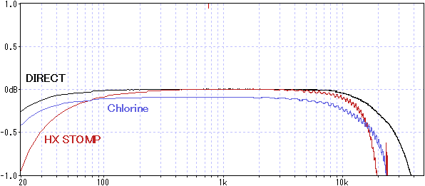
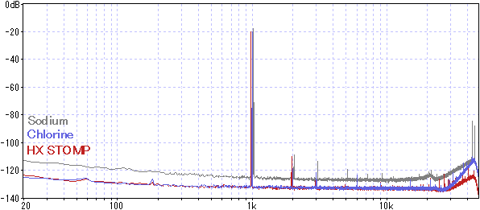

# Chlorine 開発記録
Chlorineは、Sodiumの後継機として開発を始めました。この記事では、販売までの過程で検討した内容をまとめています。

***

#### Sodiumの問題点とChlorineの目標

旧機種[Sodium](https://github.com/kanengomibako/Sodium)は、プログラミング入門機として価格を低くする目標があったため、以下のような問題点がありました。

- 操作部が少なく画面が小さい
- アクリル筐体なので外来ノイズに弱い
- オーディオコーデックの性能限界（ノイズ、最大入出力電圧が高くない）

しかしながら、Sodiumは必要な人に行き渡り、役割は果たしたと考えています。後継機Chlorineは、できるだけ低価格で上記問題点を解決しつつ、将来的にエフェクトプログラムのダウンロード販売に対応できる製品を目指しました。

***

#### ユーザーインターフェース

ZOOM MS-50G+を参考にした操作部となっています。

- スイッチ付きロータリーエンコーダ × 4、タクトスイッチ × 4

  ノブはアクリル製のトップパネルと一体で発注するため、コストを抑えられます。ただし、保護シールを剥がす手間はあります。

- 1.77インチ カラー液晶ディスプレイ（MS-50G+とほぼ同じ大きさ）

- フットスイッチ × 2

  間隔は49mm（Neural DSP Quad Cortexと同じくらい）で、やや近いかなと感じます。踏み間違い防止のため、フットスイッチの機能をカスタマイズできるようなプログラムを実装予定です。一般的なフットスイッチキャップ（取り付け部直径10mm）を取り付けることができます。

#### ケース

基板で構成されたケースにすると、製作の手間はありますが大幅にコストダウンできます。強度についてもまず問題ありません（参考：[エフェクターケース製作用基板](https://github.com/kanengomibako/PCB_Enclosure_BP)）。端子類が側面に飛び出さず、ツライチにできるのも良い点です。入出力ジャックの飛び出し部分を考慮すると、Chlorineの横幅はMS-50G+より2mm短くなっています。

***

### ▽回路図

- マイコン

  Sodiumで採用していたSTM32F722RET6との互換性は考えないことにし、JLCPCBで調達可能なSTM32H723VGT6にしました。価格は同じぐらいで、処理能力はかなり高くなります。

- オーディオコーデック

  歪み系のエフェクトを使う場合、ダイナミックレンジが106dB以上欲しいところです。その条件で絞り込むとAK4558かCS4272が候補となりますが、JLCPCBで調達でき、LINE6等採用実績が多いCS4272を選びました。マスタークロックが必要なのが少し残念ですが…。

  - テストボードでの確認

    差動入力でなくシングルエンドにすることで、最大2Vrmsの入出力が可能になりました（SN比も問題なし）。そのままだと少し出力が下がるため、出力側で1.2倍に増幅しました。VDピンへの電源供給は、デジタル（マイコン）用電源からよりアナログ用電源からの方がわずかにローノイズでした。

  - アナロググラウンド（GNDA）とデジタルグラウンド（GNDD）

    GNDAとGNDDは、オーディオコーデック直下で接続するのが一般的です。Chlorineでは、コーデック直下にGNDAとGNDDが繋がったフットプリントを置いて対処しています（DRC違反が出ます）。

    GNDは分離しないという主張もあり、[この動画（Mixed-Signal Hardware/PCB Design Tips - Phil's Lab #88）](https://www.youtube.com/watch?v=v6fTa6LRJLI)ではGNDを分離せず、部品の配置を工夫してあるようです。CS4272の評価ボードでも、特にGNDは分離されていません。しかしながら部品の配置が自由に決められない場合、ノイズが増える可能性があります。GND分離をしていないChlorineの試作初号機ではノイズに問題はありませんでしたが、偶然部品の配置がよかったのかもしれません。

- 電源

  リニアレギュレータで3.3Vを生成すると発熱が大きいため、DC-DCコンバータICを使っています。インダクタはノイズ源になりやすいので、特に配置に注意が必要です（参考：[インダクタの配置](https://techweb.rohm.co.jp/product/power-ic/dcdc/3254/)）。最初はJLCPCBのBASICパーツにあるDC-DCコンバータICを使おうとしましたが、周辺部品の設計が複雑になるため採用しませんでした。結局設計が楽なものの方が信頼性が高くなる結果になると思います。電源部やオーディオ入出力にはフェライトビーズが挿入されているのをよく見かけますが、十分に理解せずに使用するのはよくないと考え、採用していません。

  - 発熱

    室温22度で4時間連続通電したとき、最も温度が高くなるのはコーデック（49℃）、次いでマイコン（47℃）でした。

  - グラウンド接続

    電源のグラウンドは、GNDDに接続するのが推奨されているようです（参考動画：[現実的な一点アースの取り方](https://www.youtube.com/watch?v=DNxw0CQW3Yg)）。入出力ジャック付近のGNDAに接続してみると、2.8kHz付近の原因不明のノイズが観測されました。

- USB

  BOOT0ピンに3.3Vを接続した状態で電源を入れると、マイコン内蔵のブートローダーが起動します。この状態だとDFU（Device Firmware Upgrade）プロトコルを使いUSB経由でプログラムの書き換えができます。USB Type-Cだと高電圧が印加される可能性があるため、保護ダイオードはありますが念のためレギュレータを入れました。回路としては[CureSynth™ mini](https://github.com/keshikan/CureSynth_mini?tab=readme-ov-file)や[STM32 Nucleoボード](https://www.st.com/ja/evaluation-tools/nucleo-h723zg.html)を参考にしています。

- EEPROM

  最初はSodiumと同様、マイコンの内部フラッシュメモリにデータを保存するつもりでした。ただし、USB経由でフラッシュメモリを書き換えると保存データが消えてしまうので、外部EEPROMを使うことにしました。EEPROMの必要性に後から気づいたため、別基板のEEPROMをポリウレタン銅線（UEW）を使って手配線する形になりました。結果的に動作はしましたが、手配線は可能な限り避けたい作業です。

- 未実装部品

  後から機能を追加するのは難しいので、最初に最大限の拡張性を考えました。回路図データで未実装となっている部品がその名残です（MIDI入力は最後まで迷い、結局実装することにしました）。MIDI出力、エクスプレッションペダル、外部フットスイッチを想定したものですが、今後これらに対応する可能性は低いです。

***

### トラブルの対処
- オペアンプのノイズ

  TL072C（ST製）搭載のCS4272のテストボードより、TL074H（TI製）搭載のChlorine試作機の方がノイズが多くなっていました。同じオペアンプのはずが、メーカーによってノイズが違うということだったのです。今までオペアンプのノイズは重視していませんでしたが、ローノイズでコストパフォーマンスに優れているOPA1679を使うことにしました。OPA1679の最大入出力電圧は0.05V～7.5V（電源電圧-1.5V）だったので、バイアス電圧を低めにしてあります。

- ステレオ分離

  これまでモノラルのエフェクターしか開発してこなかったため、左右チャンネル間クロストークは新たな問題でした。バイアス電圧のデカップリングコンデンサの容量を増やしましたがが、両電源にするのがベストかもしれません。CS4272のVCOMピンに繋ぐコンデンサ容量も大きくしたいところですが、データシートに1μFを超えないようにと記載があります。しかしCS4272の評価ボードでは10μFの電解コンデンサが付いているので、10μFでも問題ないようです。

- ディスプレイの不具合

  試作機では、電源を頻繁にオンオフするとディスプレイが表示されなくなる不具合がありました。オシロスコープで信号を確認しようとしたところ、症状が再現しませんでした。これをヒントにSPIのクロックをプルダウンしたところ、不具合が出なくなりました。原因は特定できていませんが、ケースを組み立てた状態では不具合が発生しなかったため、ノイズが影響していた可能性があります。

- スイッチを押した時のノイズ

  試作段階で、タクトスイッチを押した時にわずかにノイズが発生しました。原因は、入力部に取り付けていた積層セラミックコンデンサ（MLCC）が基板の振動を拾っているためでした。いわゆる音鳴きというもので、高誘電率系MLCCで発生します。バイアス電圧のデカップリングコンデンサに高誘電率系MLCCを使った場合にも、同様の現象が観測されました。わずかなノイズではありますが、特に高容量MLCCの音鳴き現象には注意が必要です。

***

### 特性測定

- 周波数特性 ※±1dBに拡大（DIRECT：測定に使用している[オーディオインターフェースUR22C](https://drugscore.blog.fc2.com/blog-entry-261.html)の入出力を直結）

  

  20Hz、20kHzの低下が0.5dB未満となるようにしています。

- 正弦波 約1kHz 283mVpp ※ サンプリング周波数192kHzだとノイズが不安定になったため96kHzで測定

  

  ノイズレベルはHX STOMPと同程度です。可聴域外のノイズは多い傾向にあったので、2ndロット（Rev.D）からは出力オペアンプのフィルタを2次へと変更しています。

