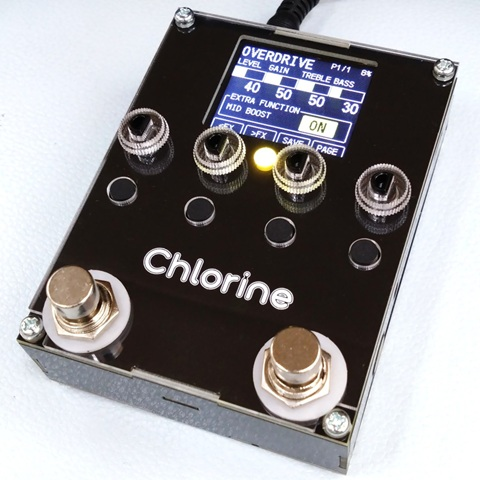

# Chlorine
### STM32 Programmable Digital Effects Pedal
STM32マイコンを搭載した、プログラミング可能なデジタルエフェクターです。C言語またはC++で開発を行います。もちろんプログラム書き込み後は単体のエフェクターとして動作可能です。

旧機種 [Sodium](https://github.com/kanengomibako/Sodium) と比較すると、処理能力は2倍以上です。また、最大入出力音量増加・ノイズ低減・操作系強化・USBアップデート機能追加等、大幅にアップグレードされました。

### 別途必要なもの
- DC9V（センターマイナス）出力のACアダプターで、0.5A以上の電流出力が可能なもの
> [!caution]
> 10V以上の電圧で連続使用しないでください。故障の原因となります。

- PC（Windows、macOS、Linux いずれも可、64bit推奨） ※ 32bit環境では使用できる開発ソフトが限られます。
- STM32対応のデバッガ（プログラム書き込みやデバッグを行う機器） 
	→ [デバッガ購入について](https://github.com/kanengomibako/Sodium/blob/main/Docs/005_%E3%83%87%E3%83%90%E3%83%83%E3%82%AC%E8%B3%BC%E5%85%A5%E3%81%AB%E3%81%A4%E3%81%84%E3%81%A6.md)
- PCとデバッガを接続するUSBケーブル
- デバッガとChlorine本体を接続するケーブル 
	→ [コネクタ付コード 3P](https://akizukidenshi.com/catalog/g/gC-15384/) と [両端ロングピンヘッダー](https://akizukidenshi.com/catalog/g/g109055/) 等

### 各部の機能
- INPUT 端子：ギターや他の機器からの出力を接続します（ステレオ入力可）。
- OUTPUT 端子：アンプや他の機器の入力へ接続します（ステレオ出力可）。
- +9VDC 端子：ACアダプターを接続します。
- 各スイッチ・ロータリーエンコーダ：任意の機能をプログラミング可能です。サンプルプログラムの操作については[別ページ](Docs/000_初期プログラムについて.md)をご参照ください。
- MIDI 入力端子：他の機器からのMIDI信号を入力することができます（TRS MIDI）。
- Serial Wire Debug (SWD) 接続ピンソケット：デバッガのSWCLK、GND、SWDIOピンを、Chlorineのピンソケットへそれぞれ接続します。
- USB Type-C 入力端子：USB Type-Cケーブルを接続することができます。

### 資料
- [初期プログラムについて](Docs/000_初期プログラムについて.md)
- [デバッガ購入について](https://github.com/kanengomibako/Sodium/blob/main/Docs/005_%E3%83%87%E3%83%90%E3%83%83%E3%82%AC%E8%B3%BC%E5%85%A5%E3%81%AB%E3%81%A4%E3%81%84%E3%81%A6.md)（旧機種Sodiumと共用ページ）
- [プログラム書き込み・デバッグ](Docs/001_プログラム書き込み・デバッグ.md)（公開準備中）
- [マイコンの機能設定](Docs/003_マイコンの機能設定.md)
- [プログラミング概要]()（公開準備中）
- [エフェクト種類管理（fx.cpp）について](Docs/100_エフェクト種類管理（fx.cpp）について.md)
- [エフェクトファイル（fx_○○.hpp）について](Docs/110_エフェクトファイル（fx_○○.hpp）について.md)
- [各エフェクト説明目次](https://github.com/kanengomibako/Sodium/blob/main/Docs/200_%E5%90%84%E3%82%A8%E3%83%95%E3%82%A7%E3%82%AF%E3%83%88%E8%AA%AC%E6%98%8E%E7%9B%AE%E6%AC%A1.md)（旧機種Sodium用ですが、基本的なプログラム内容はChlorineと同じです。）
- [USBアップデート機能について]()（公開準備中）
- [開発記録]()（公開準備中）

| 主な仕様 |  |
| - | - |
| サンプリング周波数 | 48 kHz（44.1 kHz または 96 kHz に設定可能） |
| 内部演算 | 32 ビット浮動小数点 |
| AD、DA変換 | 24 ビット |
| レイテンシ | 1.2 ミリ秒（サンプルプログラム実行時） |
| 最大入力レベル | 2.0 Vrms (+8.2 dBu) |
| 入力インピーダンス | 1 MΩ |
| 最大出力レベル | 2.0 Vrms (+8.2 dBu) |
| 出力インピーダンス | 1 kΩ |
| バイパス | バッファード・バイパス（バイパス音もAD/DA変換されます） |
| コントロール | 押しボタンスイッチ付きロータリーエンコーダ × 4 押しボタンスイッチ × 4　フットスイッチ × 2 |
| ディスプレイ | 1.77インチ 液晶ディスプレイ　カラー 160 × 128 ドット |
| インジケーター | 3色LED（直径5mm） |
| 接続端子 | INPUT端子　OUTPUT端子　電源入力端子　MIDI入力端子 Serial Wire Debug (SWD) 接続ピンソケット　USB Type-C 入力端子 |
| 消費電流 | 180 mA |
| 外形寸法 | 幅 76 mm × 奥行 100 mm × 高さ 45 mm |
| 質量 | 200 g |

